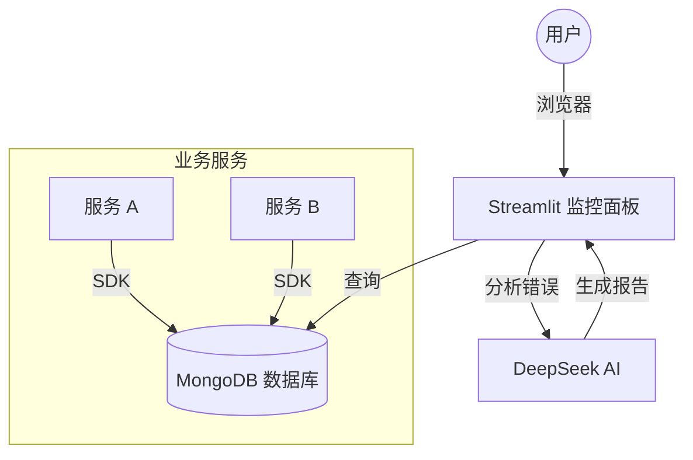

# AI 智能日志监控系统 (AI Log Monitor)

[](https://www.python.org/)
[](https://streamlit.io/)
[](https://www.mongodb.com/)
[](https://deepseek.com/)

这是一个基于 **Python** 和 **MongoDB** 的企业级日志监控系统，集成了 **DeepSeek AI** 进行智能错误归因分析。它提供了一个完整的闭环解决方案：从 SDK 日志采集、集中存储、实时可视化监控，到基于 LLM 的自动化故障诊断。

---

## 🏗️ 系统架构流程 (System Flow)



*详细架构请参考 [docs/ARCHITECTURE.md](docs/ARCHITECTURE.md)*

---

## ✨ 核心特性

- **🚀 高性能采集 SDK**: 异步、批量写入 MongoDB，对业务代码零阻塞。
- **📊 实时监控面板**: 
  - 支持 **时间范围筛选** (最近1小时/24小时/7天/自定义)。
  - **服务级错误趋势图**，快速定位故障源。
  - 支持 **Log ID 快速检索**。
- **🤖 AI 智能诊断**: 
  - 一键分析 `ERROR` 日志。
  - 集成 DeepSeek-R1，提供**根因分析**、**代码修复建议**及**相关日志上下文**。
- **🔌 易于集成**: 兼容 Python 标准 `logging` 模块。

---

## 🛠️ 快速开始

### 1. 环境准备

- 确保已安装 Python 3.9+
- 确保 MongoDB 服务已启动 (默认 `localhost:27017`)
- 克隆本项目并安装依赖：

```bash
git clone <repository_url>
cd ai-log
pip install -r requirements.txt
```

### 2. 配置 (.env)

在项目根目录创建 `.env` 文件 (可参考 `.env.example` 如果有的话，或者直接创建)：

```ini
# MongoDB Configuration
MONGO_URI=mongodb://localhost:27017/
DB_NAME=ai_log_db
COLLECTION_NAME=app_logs

# AI Configuration (DeepSeek via OpenAI Client)
AI_API_KEY=your_deepseek_api_key_here
AI_BASE_URL=https://api-ai.gitcode.com/v1
AI_MODEL=deepseek-ai/DeepSeek-R1
```

### 3. 生成模拟数据 (可选)

如果你没有现成的服务，可以运行模拟脚本生成测试日志：

```bash
python simulation/generate_logs.py
```
*该脚本会模拟产生 INFO, WARNING, ERROR 日志，包括带有堆栈信息的 Python 异常。*

### 4. 启动监控面板

```bash
streamlit run monitor/app.py
```
访问浏览器显示的地址 (通常是 `http://localhost:8501`)。

---

## 📖 使用指南

### 🔍 日志查询与筛选
1. **左侧侧边栏**: 选择服务、日志级别或输入关键词。
2. **时间范围**: 使用新增的“时间范围”下拉框，快速过滤最近发生的日志。

### 🤖 使用 AI 分析错误
1. 在日志列表中找到红色的 `ERROR` 行。
2. **点击该行**，下方会自动展开详情面板。
3. 如果是错误日志，点击右侧的 **"🔍 深度分析错误"** 按钮。
4. 等待几秒钟，AI 将生成包含问题原因和修复建议的 Markdown 报告。

### 🆔 按 ID 查找
- 如果你知道日志的 `_id`，可以直接在列表下方的 **"方法二：按ID搜索"** 输入框中输入并搜索。

---

## 📂 项目结构

- `monitor/`: 监控端代码 (Streamlit)
- `sdk/`: 日志采集 SDK
- `config/`: 配置文件
- `docs/`: 详细文档
- `simulation/`: 测试数据生成

---

## 📝 许可证

MIT License
