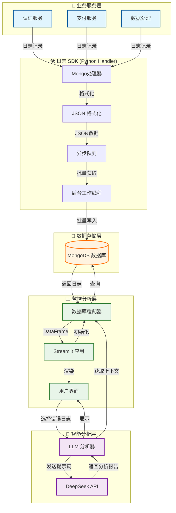

# 系统架构文档 (Technical Architecture)

## 1. 系统概览

本系统是一个端到端的智能日志监控解决方案，旨在为分布式 Python 应用提供集中式的日志管理、实时监控和基于 AI 的故障诊断能力。

核心组件包括：
1. **日志采集层 (SDK)**: 低侵入式的 Python SDK，异步采集业务日志。
2. **数据存储层 (MongoDB)**: 高性能、Schema-less 的日志存储。
3. **监控分析层 (Monitor)**: 基于 Streamlit 的交互式仪表盘。
4. **智能诊断层 (AI Analysis)**: 集成 DeepSeek 大模型，提供自动化错误根因分析。

## 2. 核心流程图 (Architecture Flowchart)



## 3. 技术栈 (Tech Stack)

- **语言**: Python 3.9+
- **Web 框架**: Streamlit (v1.28+)
- **数据库**: MongoDB (v5.0+)
- **AI 模型**: DeepSeek-R1 (via OpenAI Compatible API)
- **依赖库**:
  - `pymongo`: 数据库驱动
  - `pandas`: 数据处理与分析
  - `plotly`: 高级交互式图表
  - `openai`: AI 接口调用

## 4. 目录结构说明

```
ai-log/
├── config/             # 配置中心
│   └── settings.py     # 环境变量加载与配置类
├── docs/               # 文档中心
│   ├── LOG_SPEC.md     # 日志字段 JSON 规范
│   └── ARCHITECTURE.md # 架构设计文档
├── monitor/            # 监控端应用
│   ├── app.py          # Streamlit 前端入口
│   ├── db.py           # MongoDB 数据访问层 (DAO)
│   └── llm_analyzer.py # AI 分析与 Prompt 工程模块
├── sdk/                # 客户端 SDK
│   └── mongo_logger.py # 异步日志 Handler 实现
├── simulation/         # 仿真测试
│   └── generate_logs.py# 模拟多服务日志生成器
└── requirements.txt    # 依赖清单
```

## 5. 核心模块详解

### 5.1 日志 SDK (mongo_logger.py)
- **异步设计**: 使用 `queue.Queue` 和后台守护线程 (`daemon thread`)，确保日志写入不阻塞主业务逻辑。
- **自动上下文**: 自动抓取 `timestamp` (UTC), `trace_id` (UUID), `host` 等元数据。
- **批量写入**: 支持缓冲区机制，满 `buffer_size` 或超时自动批量 flush 到 MongoDB。

### 5.2 监控面板 (app.py)
- **实时性**: 支持手动刷新和行级选择交互。
- **可视化**: 集成 Plotly 饼图（服务分布）和折线图（错误趋势）。
- **交互**: 使用 `st.dataframe` 的 `on_select` 事件实现所见即所得的详情查看。

### 5.3 AI 分析器 (llm_analyzer.py)
- **Prompt 工程**: 包含预设的 System Prompt，指导 AI 关注根因分析、修复建议和代码示例。
- **上下文增强**: 将日志的 `message`, `stack_trace` (如果存在), `service_context` 一并发送给 AI。
- **缓存机制**: 使用 `st.session_state` 缓存分析报告，避免重复消耗 Token。

## 6. 扩展性设计

- **微服务适配**: 通过 `service_name` 和 `trace_id` 天然支持微服务架构。
- **配置分离**: 所有敏感信息（DB URL, API Key）通过 `.env` 文件管理，便于容器化部署。
- **水平扩展**: MongoDB 分片集群可支持 TB 级日志存储；Streamlit 可通过 Nginx 负载均衡部署多实例。
